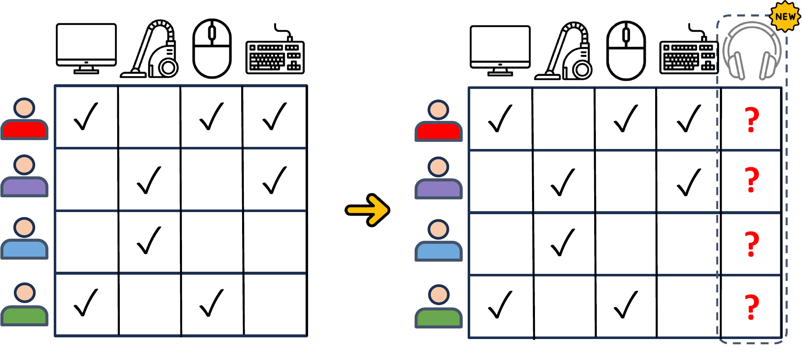
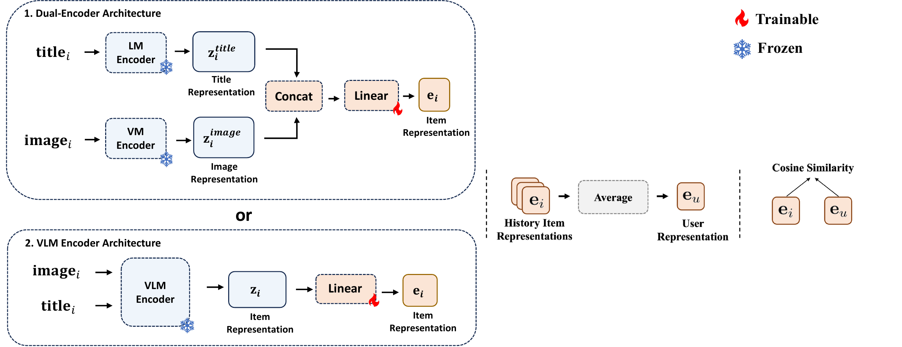
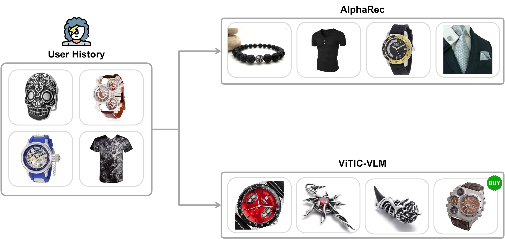

<div align=center>

<h1>ViTIC: Vision-Text Interaction for Cold Item Recommendation</h1>


<div>
    <a href="https://github.com/chg9535/" target="_blank">Jongyun Choi</a><sup>*</sup>,
    <a href="https://github.com/hanlight910/" target="_blank">Hanvit Lee</a><sup>*</sup>
</div>

<div>
  Department of AI Software, Soongsil University &nbsp;|&nbsp; Computer Vision
</div>

<div>
  {chg9535, hanvitlee}@soongsil.ac.kr
</div>

<div>
<sup>*</sup>Equal contribution.
</div>

</div>

---

Extends [AlphaRec](https://arxiv.org/abs/2412.04570) with multimodal (vision-language) item embeddings to tackle cold-start recommendation on Amazon datasets.

---

## Motivation

<div align=center>

</div>

*Cold-start problem: when a new item with no interaction history enters the catalog, collaborative filtering cannot estimate user preferences for it. ViTIC addresses this by leveraging visual and textual item representations.*

---

## Architecture

<div align=center>

</div>

*Two encoding variants. (1) **Dual-Encoder**: title and image are encoded separately by a frozen LM and VM encoder, concatenated, then projected to the item embedding space. (2) **VLM Encoder**: a single frozen VLM encoder jointly processes title and image. User representation is the average of history item embeddings; final scoring uses cosine similarity.*

---

## Case Study

<div align=center>

</div>

*Given a user whose history consists of watches and clothing, AlphaRec (text-only) recommends accessories and apparel that match text semantics but miss visual style. ViTIC-VLM captures the user's visual preference for watches and recommends visually consistent items.*

---

## Prerequisites

**Python 3.9.12 required** — Python 3.10+ breaks the `reckit` Cython evaluator.

```bash
# 1. Create conda environment
conda create -n vitic python=3.9.12 -y
conda activate vitic

# 2. PyTorch — install via pip to avoid Intel MKL conflicts
pip install torch==2.0.1 torchvision==0.15.2 --index-url https://download.pytorch.org/whl/cu118

# 3. Remaining dependencies
pip install -r requirements.txt

# 4. Build Cython evaluator (required before running)
cd models/General/base
python setup.py build_ext --inplace
cd ../../..
```

---

## Data

```bash
python scripts/download_data.py
```

Downloads the pre-processed Clothing and Beauty datasets from Google Drive into `data/General/` automatically. `gdown` is installed automatically if missing.

Expected layout after download:

```
data/General/
  amazon_clothing/
    cf_data/     train.txt  valid.txt  test.txt
    item_info/   item_cf_embeds_qwentext_8b_array.npy           # ViTIC-Text
                 item_cf_embeds_qwenvl_8b_array.npy              # ViTIC-VLM
                 item_cf_embeds_qwenvl_8b_image_array.npy        # image branch
                 item_cf_embeds_qwentext_qwenvlimg_8b_array.npy  # ViTIC-Dual
    item_titles.txt
  amazon_beauty/
    (same structure)
```

---

## Model Variants

| Model | `--lm_model` | Description |
|-------|-------------|-------------|
| ViTIC-Text | `qwentext_8b` | Text-only (Qwen3-Embedding-8B) |
| ViTIC-VLM  | `qwenvl_8b`   | Vision-language (Qwen3-VL-8B, text+image) |
| ViTIC-Dual | `qwentext_qwenvlimg_8b` | Concat of text + image-only embeddings |

---

## Training

```bash
# ViTIC-VLM on Clothing
python main.py \
  --model_name ViTIC --dataset amazon_clothing \
  --lm_model qwenvl_8b --model_version mlp \
  --n_layers 2 --tau 0.2 \
  --train_norm --pred_norm \
  --neg_sample 256 --infonce 1 \
  --saveID vitIC_vlm --no_wandb

# ViTIC-Text on Clothing
python main.py \
  --model_name ViTIC --dataset amazon_clothing \
  --lm_model qwentext_8b --model_version mlp \
  --n_layers 2 --tau 0.2 \
  --train_norm --pred_norm \
  --neg_sample 256 --infonce 1 \
  --saveID vitIC_text --no_wandb

# ViTIC-Dual on Clothing
python main.py \
  --model_name ViTIC --dataset amazon_clothing \
  --lm_model qwentext_qwenvlimg_8b --model_version mlp \
  --n_layers 2 --tau 0.2 \
  --train_norm --pred_norm \
  --neg_sample 256 --infonce 1 \
  --saveID vitIC_dual --no_wandb
```

Replace `amazon_clothing` with `amazon_beauty` for the Beauty dataset.  
Checkpoints are saved to `weights/General/<dataset>/ViTIC/<saveID>/`.

---

## Cold-Start Evaluation

```bash
python scripts/eval_coldstart.py \
  --dataset amazon_clothing \
  --saveID vitIC_vlm \
  --lm_model qwenvl_8b \
  --model_version mlp --n_layers 2 \
  --train_norm --pred_norm
```

---

## Results

### Overall Performance (Recall@20 / NDCG@20 / HR@20)

| Model | Clothing R@20 | N@20 | HR@20 | Beauty R@20 | N@20 | HR@20 |
|-------|:---:|:---:|:---:|:---:|:---:|:---:|
| MF | 0.0175 | 0.0078 | 0.0178 | 0.0610 | 0.0296 | 0.0775 |
| MultVAE | 0.0395 | 0.0181 | 0.0401 | 0.0809 | 0.0398 | 0.0997 |
| LightGCN | 0.0526 | 0.0235 | 0.0533 | 0.0894 | 0.0429 | 0.1105 |
| SGL | 0.0463 | 0.0216 | 0.0469 | 0.0842 | 0.0427 | 0.1048 |
| XSimGCL | 0.0557 | 0.0254 | 0.0563 | 0.0938 | 0.0464 | 0.1155 |
| AlphaRec | 0.0971 | 0.0428 | 0.0981 | **0.1039** | **0.0480** | **0.1276** |
| ViTIC-Dual | 0.0997 | 0.0436 | 0.1008 | **0.1041** | 0.0475 | 0.1273 |
| **ViTIC-VLM** | **0.1005** | **0.0443** | **0.1018** | 0.1038 | **0.0491** | 0.1268 |

---

## Acknowledgements

Built on top of [AlphaRec](https://github.com/shengze-xu/AlphaRec).  
Item embeddings extracted with [Qwen3-Embedding-8B](https://huggingface.co/Qwen/Qwen3-Embedding-8B) and [Qwen3-VL-Embedding-8B](https://huggingface.co/Qwen/Qwen3-VL-Embedding-8B).
